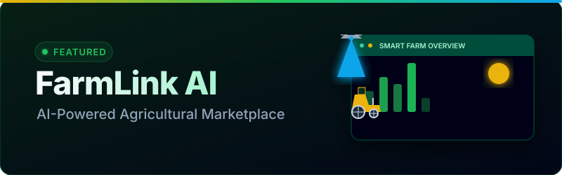

<picture>
  <source media="(prefers-color-scheme: dark)" srcset="assets/hero.svg">
  
</picture>

 
 

 
 

<!-- Social Badges -->

  
  
  
  
  
  
  

 

<!-- ==========================================
     ABOUT ME
     ========================================== -->

## 🌟 About Me

 
 

### Dipendra Kumar

*Haryana, India · B.Tech CSE @ MMDU · Class of 2027*

 

I am a passionate **Full Stack Developer** who enjoys building modern web applications and AI-powered products. I have experience working with frontend and backend technologies to create scalable, responsive, and user-friendly applications.

I enjoy learning new technologies and continuously improving my software engineering skills. I love building AI-powered products that solve real-world problems.

**🎯 Mission** — Build impactful software that improves people's lives.

**🚀 Career Goal** — Become a Software Engineer and AI Product Builder.

**📚 Currently Learning** — System Design · Cloud Computing · AI Agents & LLMs · DevOps · Advanced DSA using Java

 

  

 

<!-- ==========================================
     TECH STACK
     ========================================== -->

## 💻 Tech Stack

 
 

### 🌐 Languages

### 🎨 Frontend

### ⚙️ Backend

### 🗄️ Database

### ☁️ Cloud & DevOps

### 🛠️ Tools

### 🧠 AI & ML

 

<!-- ==========================================
     FEATURED PROJECTS
     ========================================== -->

## 🚀 Featured Projects

 

<!-- 1. FarmLink AI -->

  

### 🌾 1. FarmLink AI

AI-powered agriculture platform connecting farmers, buyers and experts.

**✨ Features:** AI Farming Assistant · Marketplace · Crop Recommendation · Weather Forecast · Pest Detection · Price Forecast · Analytics Dashboard · Role Based Access · Payments · Gemini AI

**🛠 Tech Stack:** HTML, CSS, JavaScript, Tailwind CSS, Python, Flask, PostgreSQL, Gemini API, Razorpay, Git, GitHub, Vercel

  
  
  

---

### 📚 2. StudyForge

Smart educational learning platform with AI-powered productivity tools, study planner, note management, analytics, and learning dashboard.

**🛠 Future Improvements:** Integrate collaborative study rooms and deeper NLP for automatic quiz generation.

  
  

---

### 🎬 3. ClipForge

AI-powered content creation platform for automatic short-video generation, subtitle creation, clip scoring, and workflow automation.

  
  

---

### 🎫 4. EventHub

Modern event management system with registrations, scheduling, ticket management, dashboards, and analytics.

  
  

---

### 👨‍💻 5. Portfolio

Personal portfolio showcasing projects, skills, blogs, achievements, and contact information. Built with modern, responsive UI elements.

  
  

---

### 🤖 6. AI Chatbot

Modern conversational AI chatbot powered by LLM APIs with multi-session chat support and context awareness.

  
  

---

### 🏥 7. MediGuard

Healthcare management platform with appointments, authentication, patient records, analytics, and dashboards.

  
  

---

### 🛒 8. GharMart

Modern real estate marketplace with property listings, advanced search, and user dashboard.

  
  

---

### 🎁 9. Bubu Wishes

Interactive AI-powered birthday wishes platform with countdowns, animations, media sharing, and personalized greeting cards.

  
  

 

  

 

<!-- ==========================================
     INTERNSHIPS
     ========================================== -->

## 💼 Internships

 

### 1. CodSoft
**Role:** Web Development Intern  
**Timeline:** May 2025 – June 2025  
Worked on responsive websites using HTML, CSS, JavaScript.

### 2. KVCH
**Role:** Java Intern  
**Timeline:** Nov 2023 – Dec 2023  
Developed Java-based E-commerce applications.

### 3. ICE Technology Lab
**Role:** Web Technology Intern  
**Timeline:** Dec 2022 – Jan 2023  
Built frontend applications using HTML, CSS, JavaScript.

 

<!-- ==========================================
     EDUCATION & CERTIFICATIONS
     ========================================== -->

## 🎓 Education & 🏆 Certifications

 

### Education

- **B.Tech CSE** — Maharishi Markandeshwar (Deemed to be University) · *CGPA: 7.43*
- **Diploma CSE** — Government Polytechnic Gulzarbagh · *CGPA: 8.02*
- **12th Grade** — *Percentage: 76.8%*
- **10th Grade** — *Percentage: 64.2%*

### Certifications

- **CodSoft Web Development Internship**
- **KVCH Java Internship**
- **ICE Technology Lab Internship**

 

  

 

<!-- ==========================================
     GITHUB ANALYTICS
     ========================================== -->

## 📊 GitHub Analytics

 
 

<!-- Contribution Snake -->
<picture>
  <source media="(prefers-color-scheme: dark)" srcset="https://raw.githubusercontent.com/Dipendra2003/Dipendra2003/output/dist/github-contribution-grid-snake-dark.svg">
  <source media="(prefers-color-scheme: light)" srcset="https://raw.githubusercontent.com/Dipendra2003/Dipendra2003/output/dist/github-contribution-grid-snake.svg">
  
</picture>

 
 

<!-- GitHub Stats -->

 
 

<!-- Top Languages -->

 
 

<!-- GitHub Trophies -->

 

<!-- ==========================================
     FOOTER
     ========================================== -->

  

