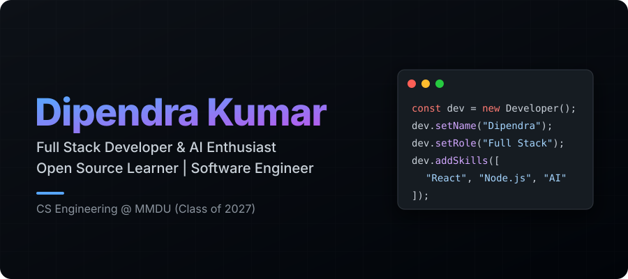
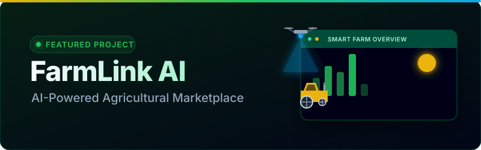
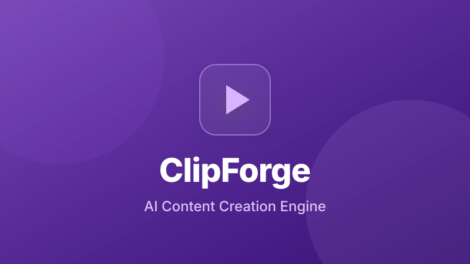
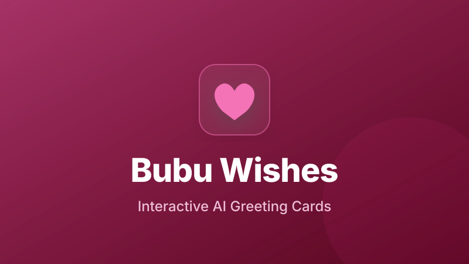
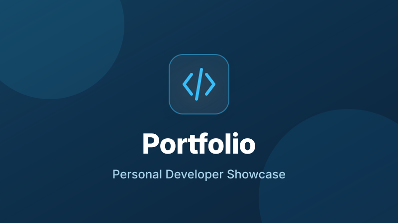

<picture>
  <source media="(prefers-color-scheme: dark)" srcset="assets/hero.svg">
  
</picture>

 
 

 
 

<!-- Social Badges -->

  
  
  
  
  
  
  

 

<!-- ==========================================
     ABOUT ME
     ========================================== -->

  <h2>🌟 About Me</h2>
  

 

<table align="center" border="0" width="100%" style="background-color: transparent;">
  <tr>
    <td width="30%" align="center">
      
    </td>
    <td width="70%">
      <h3>Dipendra Kumar</h3>
      
<em>Haryana, India · B.Tech CSE @ MMDU · Class of 2027</em>

      
I am a passionate <b>Full Stack Developer</b> who enjoys building modern web applications and AI-powered products. I have experience working with frontend and backend technologies to create scalable, responsive, and user-friendly applications.

      
<b>🎯 Mission:</b> Build impactful software that improves people's lives.

      
<b>🚀 Goal:</b> Become a Software Engineer and AI Product Builder.

      
<b>📚 Learning:</b> System Design · Cloud Computing · AI Agents · DevOps

    </td>
  </tr>
</table>

 

  

 

<!-- ==========================================
     TECH STACK
     ========================================== -->

## 💻 Tech Stack

 
 

### 🌐 Languages

### 🎨 Frontend

### ⚙️ Backend

### 🗄️ Database & ORM

### ☁️ Cloud & DevOps

### 🛠️ Developer Tools

### 🧠 AI & Machine Learning

 

<!-- ==========================================
     PREMIUM FEATURED PROJECTS
     ========================================== -->

  <h2>🚀 Premium Featured Projects</h2>
  

 

<!-- ==========================================
     FLAGSHIP PROJECT: FARMLINK AI
     ========================================== -->

  
  
    
  
  <h1>🌾 FarmLink AI</h1>
  
<b>An advanced AI-powered agriculture platform connecting farmers, buyers, and agronomists.</b>

  
  

    
    
    
  

  

    
  

 

### 🎯 Problem Statement
Farmers often face challenges such as limited access to buyers, fluctuating market prices, lack of real-time agricultural information, and dependence on intermediaries. These issues reduce profitability and make it difficult for farmers to adopt modern farming practices and make informed decisions.

### 💡 Solution Overview
**FarmLink AI** is an AI-powered agriculture platform that bridges the gap between farmers and buyers through a secure digital marketplace. The platform leverages artificial intelligence to provide smart crop recommendations, real-time market insights, voice assistance, and seamless crop trading, helping farmers increase productivity and maximize profits.

### 🏗 Architecture Summary
`Frontend (HTML/JS/Tailwind)` ➡️ `Flask Backend API` ➡️ `PostgreSQL DB` ➡️ `Gemini AI Engine` ➡️ `Vercel Deployment`

### ✨ Key Highlights & Features
- 🤖 AI-Powered Crop Recommendations
- 🌿 AI Pest & Disease Detection
- 🗣️ Voice-Based Farming Assistant
- 🛒 Direct Farmer-to-Buyer Marketplace
- 📦 Smart Crop & Inventory Management
- 📊 Real-Time Market Price Analytics
- 🔐 Secure Authentication & KYC Verification
- 👨‍🌾 Farmer & Buyer Dashboards
- 📱 Fully Responsive & User-Friendly Interface
- 📍 Location-Based Crop Listings
- 📈 Sales & Transaction Management
- ⚡ Fast, Secure & Scalable Architecture
- 🌦️ Weather Information Integration
- 💬 AI Chat Assistant for Farming Support

### 💻 Technology Stack

  
  
  
  
  
  

  
  &nbsp;&nbsp;
  

  

  

 

<!-- ==========================================
     PROJECT CATEGORIES
     ========================================== -->

### 📚 Education & Content Creation

<table align="center" width="100%">
  <tr>
    <td width="50%" valign="top">
      

        
        <h3>StudyForge</h3>
        <i>"Next-generation digital campus"</i>
      

       
      <b>Problem Solved:</b> Fragmented study tools lead to context switching and productivity loss for students.
        
      <b>Core Features:</b>
       🤖 AI Quiz Generation
       📊 Performance Dashboard
       ☁️ Cloud Note Sync
        
      

        
      

    </td>
    <td width="50%" valign="top">
      

        
        <h3>ClipForge</h3>
        <i>"AI video automation at scale"</i>
      

       
      <b>Problem Solved:</b> Manual short-form video editing is tedious and extremely time-consuming for creators.
        
      <b>Core Features:</b>
       ✨ Auto-Subtitling
       🤖 Highlight Extraction
       ⚡ Fast Rendering
        
      

        
      

    </td>
  </tr>
</table>

### 🏥 Healthcare & Marketplace Solutions

<table align="center" width="100%">
  <tr>
    <td width="50%" valign="top">
      

        
        <h3>MediGuard</h3>
        <i>"Secure healthcare management"</i>
      

       
      <b>Problem Solved:</b> Paper-based medical records cause critical delays and security vulnerabilities.
        
      <b>Core Features:</b>
       🔐 Role-based Auth
       📅 Smart Appointments
       📊 Patient Analytics
        
      

        
      

    </td>
    <td width="50%" valign="top">
      

        
        <h3>GharMart</h3>
        <i>"Modern real estate ecosystem"</i>
      

       
      <b>Problem Solved:</b> High brokerage fees and non-verified property listings plague the housing market.
        
      <b>Core Features:</b>
       📍 Geolocation Search
       💳 Secure Bookings
       📱 Fully Responsive
        
      

        
      

    </td>
  </tr>
</table>

### 🤖 AI Applications & Experiences

<table align="center" width="100%">
  <tr>
    <td width="50%" valign="top">
      

        
        <h3>AI Chatbot</h3>
        <i>"Intelligent conversational agent"</i>
      

       
      <b>Problem Solved:</b> Lack of context-aware, persistent conversational memory in simple chatbot templates.
        
      <b>Core Features:</b>
       🧠 Contextual Memory
       ⚡ Low Latency API
       🌐 Multi-session
        
      

        
      

    </td>
    <td width="50%" valign="top">
      

        
        <h3>Bubu Wishes</h3>
        <i>"AI personalized greetings"</i>
      

       
      <b>Problem Solved:</b> Generic digital greetings lack the personalization and interactive flair that people crave.
        
      <b>Core Features:</b>
       ✨ Dynamic Animations
       🎵 Media Sharing
       📱 Responsive UI
        
      

        
      

    </td>
  </tr>
</table>

### 🏢 Platform & Portfolio

<table align="center" width="100%">
  <tr>
    <td width="50%" valign="top">
      

        
        <h3>EventHub</h3>
        <i>"End-to-end event lifecycle"</i>
      

       
      <b>Problem Solved:</b> Managing ticketing, schedules, and attendees across multiple tools is chaotic for organizers.
        
      <b>Core Features:</b>
       🎟️ Ticketing Engine
       📊 Organizer Dashboard
       🔐 Secure Auth
        
      

        
      

    </td>
    <td width="50%" valign="top">
      

        
        <h3>Developer Portfolio</h3>
        <i>"Personal digital presence"</i>
      

       
      <b>Problem Solved:</b> Provides a centralized, highly optimized hub for recruiters to view my engineering capabilities.
        
      <b>Core Features:</b>
       ⚡ Fast Performance
       📱 Mobile First
       🌐 SEO Optimized
        
      

        
        
      

    </td>
  </tr>
</table>

 

  

 

  ━━━━━━━━━━━━━━━━━━━━━━━━━━━━
    
  <h3>🚀 Interested in more projects?</h3>
   
  
    
  ━━━━━━━━━━━━━━━━━━━━━━━━━━━━

 

  

 

<!-- ==========================================
     EXPERIENCE & EDUCATION
     ========================================== -->

  <h2>💼 Experience & 🎓 Education</h2>
  

 

### 💼 Professional Experience

 

<table width="100%" align="center">
  <tr>
    <td width="33%" valign="top">
      

        
          
        <i>Web Development Intern</i>
         
        
      

       
      <b>Responsibilities:</b>
      <ul>
        <li>Engineered responsive, highly interactive web applications tailored to modern design standards.</li>
        <li>Architected and developed modular, reusable UI components to accelerate development workflows.</li>
        <li>Optimized frontend rendering performance, ensuring fluid user experiences across diverse devices.</li>
      </ul>
      

          
      

    </td>
    <td width="33%" valign="top">
      

        
          
        <i>Java Developer Intern</i>
         
        
      

       
      <b>Responsibilities:</b>
      <ul>
        <li>Developed scalable backend Java applications, focusing on robust data processing pipelines.</li>
        <li>Spearheaded the integration of E-Commerce modules to support digital marketplace operations.</li>
        <li>Applied advanced Object-Oriented Programming (OOP) paradigms to ensure code maintainability.</li>
      </ul>
      

          
      

    </td>
    <td width="33%" valign="top">
      

        
          
        <i>Web Technology Intern</i>
         
        
      

       
      <b>Responsibilities:</b>
      <ul>
        <li>Constructed semantic, responsive web pages utilizing foundational web stacks.</li>
        <li>Implemented dynamic frontend behaviors through JavaScript DOM manipulation.</li>
        <li>Adhered strictly to frontend best practices and accessibility guidelines.</li>
      </ul>
      

          
      

    </td>
  </tr>
</table>

 
 

### 🎓 Academic Journey

 

<table width="100%" align="center">
  <tr>
    <td width="50%" valign="top">
      

        
      

       
      

        <b>Maharishi Markandeshwar (Deemed to be University)</b>
         
        
          
        <b>CGPA:</b> 
      

       
      <b>Relevant Coursework:</b>
       
           
    </td>
    <td width="50%" valign="top">
      

        
      

       
      

        <b>Government Polytechnic Gulzarbagh</b>
         
        
          
        <b>CGPA:</b> 
      

       
      <b>Key Achievements:</b>
      <ul>
        <li>Successfully designed and delivered multiple independent software development projects.</li>
      </ul>
    </td>
  </tr>
  <tr>
    <td width="50%" valign="top">
      

        
      

       
      

        <b>Sri Nandipat Jitu +2 Antarbarti College, Sonbarsa</b>
         
        
          
        <b>Score:</b> 
      

    </td>
    <td width="50%" valign="top">
      

        
      

       
      

        <b>S.N.J High School, Sonbarsa, Sitamarhi</b>
         
        
          
        <b>Score:</b> 
      

    </td>
  </tr>
</table>

 

  

 

<!-- ==========================================
     ACHIEVEMENTS, LEARNING & GOALS
     ========================================== -->

<table align="center" width="100%">
  <tr>
    <td width="33%" valign="top">
      

        <h3>🏆 Key Achievements</h3>
      

       
      <ul>
        <li>Completed multiple industry internships with successful project deliverables.</li>
        <li>Architected and built production-ready AI-powered applications.</li>
        <li>Developed scalable, responsive full-stack web platforms from scratch.</li>
        <li>Demonstrated exceptional problem-solving capabilities utilizing advanced DSA.</li>
        <li>Passionate advocate for Artificial Intelligence and modern Software Engineering.</li>
      </ul>
    </td>
    <td width="33%" valign="top">
      

        <h3>🚀 Currently Learning</h3>
      

       
      

        
         
        
         
        
         
        
         
        
         
        
         
        
         
        
      

    </td>
    <td width="34%" valign="top">
      

        <h3>🎯 Career Goal</h3>
      

       
      

        <i>"To become a highly proficient Full Stack Software Engineer specializing in <b>AI-powered applications</b>, scalable backend systems, cloud technologies, and modern web development, while actively contributing to impactful open-source projects."</i>
      

    </td>
  </tr>
</table>

 

<!-- ==========================================
     GITHUB ANALYTICS
     ========================================== -->

  <h2>📊 GitHub Analytics</h2>
  

 

<table align="center" width="100%">
  <tr>
    <td width="50%" valign="top">
      

        
      

    </td>
    <td width="50%" valign="top">
      

        
      

    </td>
  </tr>

</table>

 

<!-- ==========================================
     LICENSE
     ========================================== -->

## 📄 License

 
 

This project is licensed under the **MIT License**.

You are free to:

✅ Use · ✅ Modify · ✅ Distribute · ✅ Fork · ✅ Create commercial or personal projects

while preserving the original copyright notice and license.

If you use this repository or any part of it, attribution is appreciated.

**Copyright © 2026 Dipendra Kumar**

For more details, see the [LICENSE](LICENSE) file.

 

<!-- ==========================================
     SUPPORT
     ========================================== -->

## ❤️ Support

 
 

If you found this repository useful, consider:

⭐ **Starring** the repository · 🍴 **Forking** the project · 🤝 **Contributing** improvements

🐛 **Reporting** issues · 💡 **Sharing** feedback

Every contribution helps make this project better.

 

<!-- ==========================================
     CONTACT
     ========================================== -->

## 📬 Contact

 
 

**Author: Dipendra Kumar**

 

 

<!-- ==========================================
     DISCLAIMER
     ========================================== -->

## ⚠️ Disclaimer

 
 

This project is provided for **educational, research, and portfolio purposes**.

While every effort has been made to ensure reliability and correctness, **no warranty is provided**.

Use this project at your own discretion.

 

<!-- ==========================================
     BUILT WITH PASSION
     ========================================== -->

## 💙 Built with Passion

 
 

Designed, Developed, and Maintained by

**Dipendra Kumar**

Full Stack Developer • AI Enthusiast • Software Engineering Student

© 2026 Dipendra Kumar. Licensed under the MIT License.

 

<!-- ==========================================
     FOOTER
     ========================================== -->

  

